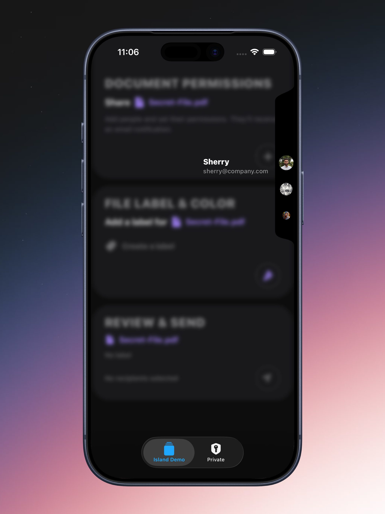
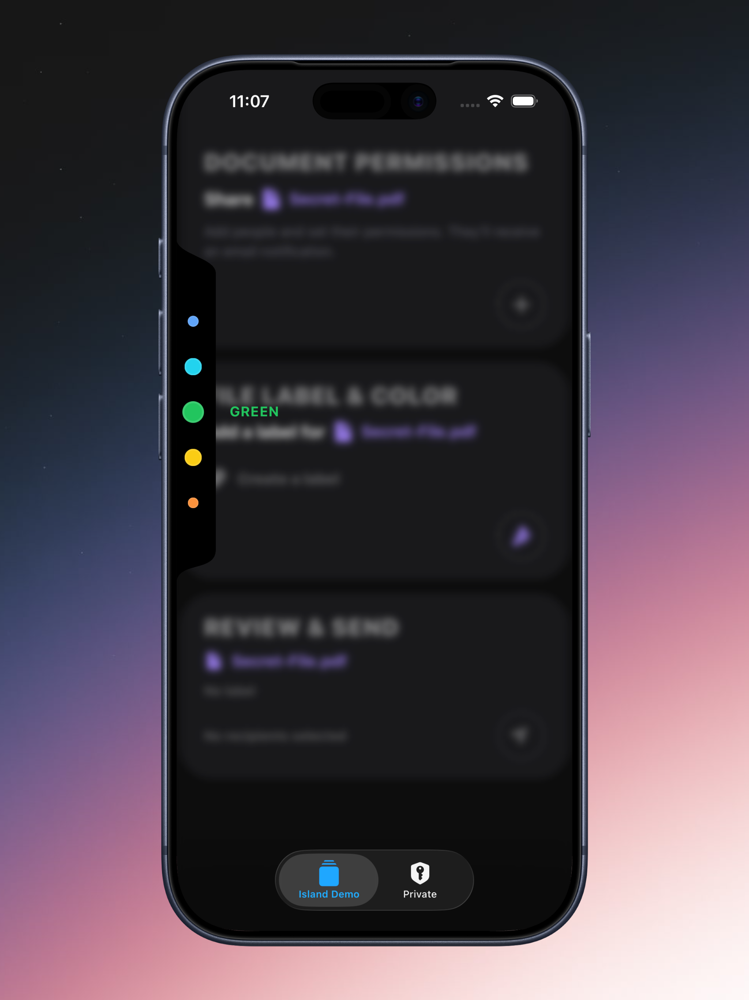

# @peersahab/side-island

A Skia-powered side island overlay for React Native, with an internal virtualized list (FlatList) and an optional Provider + hooks control layer. Perfect for quick access menus, color pickers, and other side-mounted UI components.

## Install

```bash
npm i @peersahab/side-island
```

### Peer dependencies (required)

This library expects these to be installed in your app:

```bash
npm i @shopify/react-native-skia react-native-reanimated
```

## Appearance

The `SideIsland` component can be positioned on either side of the screen and displays a smooth, wave-shaped overlay with a virtualized list of items.

### Right Position



### Left Position



## Quick Start

### Basic Usage

```tsx
import React from "react";
import { View } from "react-native";
import { SideIsland } from "@peersahab/side-island";

export function Example() {
  const items = Array.from({ length: 40 }).map((_, i) => ({ id: String(i) }));

  return (
    <View style={{ flex: 1 }}>
      <SideIsland
        items={items}
        keyExtractor={(item) => item.id}
        renderItem={({ item }) => (
          <View style={{ width: 32, height: 32, borderRadius: 16, backgroundColor: "#00000022" }} />
        )}
      />
    </View>
  );
}
```

### With Haptics

```tsx
import React from "react";
import * as Haptics from "expo-haptics";
import { SideIsland } from "@peersahab/side-island";

export function Example() {
  return (
    <SideIsland
      items={items}
      renderItem={({ item }) => <YourItem item={item} />}
      haptics={{
        onOpen: () => Haptics.impactAsync(Haptics.ImpactFeedbackStyle.Light),
        onClose: () => Haptics.impactAsync(Haptics.ImpactFeedbackStyle.Light),
        onFocusChange: () => Haptics.impactAsync(Haptics.ImpactFeedbackStyle.Rigid),
      }}
    />
  );
}
```

### With Backdrop and Focused Item Detail

```tsx
import React from "react";
import { BlurView } from "expo-blur";
import { useWindowDimensions } from "react-native";
import { SideIsland } from "@peersahab/side-island";

export function Example() {
  const { width, height } = useWindowDimensions();
  const [expanded, setExpanded] = useState(false);

  return (
    <SideIsland
      expanded={expanded}
      onToggleExpanded={setExpanded}
      items={people}
      renderItem={({ item }) => <AvatarItem person={item} />}
      backdropComponent={
        <BlurView intensity={20} style={{ width, height }} tint="dark" />
      }
      renderFocusedItemDetail={({ item }) => (
        <View>
          <Text>{item.name}</Text>
          <Text>{item.email}</Text>
        </View>
      )}
    />
  );
}
```

## Provider + Hook Pattern

### Setup Provider

Wrap your app once with the provider:

```tsx
import React from "react";
import { SideIslandProvider } from "@peersahab/side-island";

export function AppRoot() {
  return (
    <SideIslandProvider
      defaultExpanded={false}
      config={{
        position: "right",
        width: 40,
        height: 300,
      }}
    >
      {/* your navigation tree */}
    </SideIslandProvider>
  );
}
```

### Control from Anywhere

Use the hook to control the island from any component:

```tsx
import React from "react";
import { Button } from "react-native";
import { useSideIsland } from "@peersahab/side-island";

export function ToggleIslandButton() {
  const island = useSideIsland();
  
  return (
    <Button 
      title={island.expanded ? "Close" : "Open"} 
      onPress={island.toggle} 
    />
  );
}
```

### Render Island (uses Provider state)

When using the provider, the island automatically uses the provider's state:

```tsx
import React from "react";
import { SideIsland } from "@peersahab/side-island";

export function IslandOverlay() {
  return (
    <SideIsland
      items={items}
      renderItem={({ item }) => <YourItem item={item} />}
      // No need to pass expanded/onToggleExpanded - uses provider state
    />
  );
}
```

## API Reference

### `SideIsland<ItemT>`

The main component that renders the side island overlay.

#### Required Props

| Prop | Type | Description |
|------|------|-------------|
| `items` | `readonly ItemT[]` | Array of items to display in the island |
| `renderItem` | `(info: { item: ItemT; index: number }) => React.ReactElement \| null` | Function to render each item |

#### Optional Props

##### List Configuration

| Prop | Type | Default | Description |
|------|------|---------|-------------|
| `keyExtractor` | `(item: ItemT, index: number) => string` | `(_, index) => String(index)` | Function to extract unique keys for items |
| `listProps` | `Omit<FlatListProps<ItemT>, "data" \| "renderItem" \| "keyExtractor">` | - | Additional props to pass to the internal FlatList |
| `onFocusedItemChange` | `(info: { item: ItemT; index: number } \| null) => void` | - | Called when the focused item changes (item closest to center) |

##### Position & Layout

| Prop | Type | Default | Description |
|------|------|---------|-------------|
| `position` | `"left" \| "right"` | `"right"` | Which side of the screen the island is pinned to |
| `width` | `number` | `40` | Width of the island in pixels |
| `height` | `number` | `250` | Height of the island in pixels |
| `topOffset` | `number` | `0` | Vertical offset from center in pixels (positive = down, negative = up) |
| `style` | `ViewStyle` | - | Additional styles for the island container |

##### Wave Shape (Advanced)

| Prop | Type | Default | Description |
|------|------|---------|-------------|
| `waveAmplitude` | `number` | `18` | Amplitude of the wave bulge (controls how much it extends) |
| `waveY1` | `number` | `0.1` | Top wave peak position (0-1, relative to height) |
| `waveY2` | `number` | `0.9` | Bottom wave peak position (0-1, relative to height) |

##### Appearance

| Prop | Type | Default | Description |
|------|------|---------|-------------|
| `backgroundColor` | `string` | `"#000000"` | Background color of the island |
| `handleWidth` | `number` | `16` | Width of the touchable handle area (0 to disable) |

##### State Management

| Prop | Type | Default | Description |
|------|------|---------|-------------|
| `expanded` | `boolean` | - | Controlled expanded state (if provided, component is controlled) |
| `onToggleExpanded` | `(next: boolean) => void` | - | Callback when expanded state should change (required if `expanded` is provided) |
| `defaultExpanded` | `boolean` | `false` | Initial expanded state (only used if uncontrolled) |

##### Interaction

| Prop | Type | Default | Description |
|------|------|---------|-------------|
| `onPress` | `() => void` | - | Fired when the handle area is pressed (island still toggles automatically) |
| `haptics` | `SideIslandHaptics` | - | Haptics adapter for feedback (see Haptics section below) |

##### Advanced Features

| Prop | Type | Default | Description |
|------|------|---------|-------------|
| `backdropComponent` | `React.ReactElement` | - | Component to render as backdrop (fades in when expanded) |
| `renderFocusedItemDetail` | `(info: { item: ItemT; index: number; expanded: boolean; setExpanded: (next: boolean) => void }) => React.ReactElement \| null` | - | Component to render details of the focused item (displayed opposite the island) |
| `focusedItemDetailGap` | `number` | `16` | Horizontal gap between focused item detail and island |

### `SideIslandProvider`

Provider component for managing island state globally.

#### Props

| Prop | Type | Default | Description |
|------|------|---------|-------------|
| `children` | `React.ReactNode` | - | Child components |
| `defaultExpanded` | `boolean` | `false` | Initial expanded state |
| `onExpandedChange` | `(next: boolean) => void` | - | Callback when expanded state changes |
| `config` | `SideIslandConfig` | - | Default configuration for all islands (see `SideIslandConfig` below) |
| `value` | `{ expanded: boolean; setExpanded: (next: boolean) => void; config?: SideIslandConfig }` | - | External state control (for advanced use cases) |

### `useSideIsland()`

Hook to access and control the island state from the provider.

#### Returns

```typescript
{
  expanded: boolean;
  setExpanded: (next: boolean) => void;
  open: () => void;
  close: () => void;
  toggle: () => void;
  config: SideIslandConfig;
}
```

### `SideIslandConfig`

Configuration object for default island settings (used in Provider or individual islands).

| Property | Type | Default | Description |
|----------|------|---------|-------------|
| `position` | `"left" \| "right"` | `"right"` | Default position |
| `width` | `number` | `40` | Default width |
| `height` | `number` | `250` | Default height |
| `waveAmplitude` | `number` | `18` | Default wave amplitude |
| `waveY1` | `number` | `0.1` | Default top wave position |
| `waveY2` | `number` | `0.9` | Default bottom wave position |
| `backgroundColor` | `string` | `"#000000"` | Default background color |
| `handleWidth` | `number` | `16` | Default handle width |
| `topOffset` | `number` | `0` | Default top offset |
| `haptics` | `SideIslandHaptics` | - | Default haptics adapter |

### `SideIslandHaptics`

Haptics adapter interface for providing haptic feedback.

| Property | Type | Description |
|----------|------|-------------|
| `onOpen` | `() => void \| Promise<void>` | Called when island opens |
| `onClose` | `() => void \| Promise<void>` | Called when island closes |
| `onFocusChange` | `(info: { index: number } \| null) => void \| Promise<void>` | Called when focused item changes |

**Example with expo-haptics:**

```tsx
import * as Haptics from "expo-haptics";

<SideIsland
  haptics={{
    onOpen: () => Haptics.impactAsync(Haptics.ImpactFeedbackStyle.Light),
    onClose: () => Haptics.impactAsync(Haptics.ImpactFeedbackStyle.Light),
    onFocusChange: () => Haptics.impactAsync(Haptics.ImpactFeedbackStyle.Rigid),
  }}
  // ... other props
/>
```

## Running the Example App

The repository includes an example Expo app demonstrating various use cases.

### Prerequisites

- Node.js (v18 or later)
- npm or yarn
- Expo CLI (optional, but recommended): `npm install -g expo-cli`

### Setup

1. **Install dependencies for the main package:**
   ```bash
   npm install
   ```

2. **Build the package:**
   ```bash
   npm run build
   ```

3. **Navigate to the example app:**
   ```bash
   cd apps/example
   ```

4. **Install example app dependencies:**
   ```bash
   npm install
   ```

### Running

**Start the Expo development server:**
```bash
npm start
```

This will open the Expo DevTools. From there you can:

- Press `i` to open iOS simulator (requires Xcode on macOS)
- Press `a` to open Android emulator (requires Android Studio)
- Scan the QR code with Expo Go app on your physical device
- Press `w` to open in web browser

**Or use the specific platform commands:**
```bash
npm run ios      # iOS simulator
npm run android  # Android emulator
npm run web      # Web browser
```

### Example App Features

The example app demonstrates:
- People picker with avatar items
- Color picker with label colors
- Focused item detail views
- Backdrop blur effects
- Haptic feedback integration
- Multiple islands (left and right positioned)

## TypeScript

The library is written in TypeScript and includes full type definitions. All exports are properly typed:

```typescript
import { 
  SideIsland, 
  SideIslandProvider, 
  useSideIsland,
  type SideIslandProps,
  type SideIslandConfig,
  type SideIslandController,
  type SideIslandPosition,
  type SideIslandHaptics,
} from "@peersahab/side-island";
```

## License

MIT
